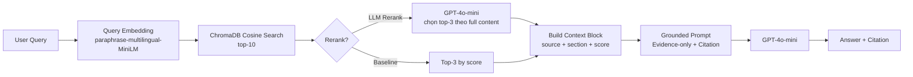

# Architecture — RAG Pipeline (Day 08 Lab)

## 1. Tổng quan kiến trúc

```
[Raw Docs (.txt)]
      ↓
[index.py: Preprocess → Chunk → Embed → Store]
      ↓
[ChromaDB Vector Store (Persistent)]
      ↓
[rag_answer.py: Query → Retrieve → (Rerank) → Generate]
      ↓
[Grounded Answer + Citation [1][2]...]
```

**Mô tả ngắn gọn:**
Nhóm xây dựng trợ lý nội bộ cho khối CS + IT Helpdesk, phục vụ nhân viên tra cứu chính sách công ty (SLA ticket, quy trình hoàn tiền, cấp quyền hệ thống, chính sách HR). Hệ thống trả lời bằng chứng cứ trích dẫn trực tiếp từ tài liệu đã index, không suy đoán ngoài context.

---

## 2. Indexing Pipeline (Sprint 1)

### Tài liệu được index
| File | Nguồn | Department | Số chunk |
|------|-------|-----------|---------|
| `policy_refund_v4.txt` | policy/refund-v4.pdf | CS | ~8 |
| `sla_p1_2026.txt` | support/sla-p1-2026.pdf | IT | ~6 |
| `access_control_sop.txt` | it/access-control-sop.md | IT Security | ~7 |
| `it_helpdesk_faq.txt` | support/helpdesk-faq.md | IT | ~9 |
| `hr_leave_policy.txt` | hr/leave-policy-2026.pdf | HR | ~5 |

### Quyết định chunking
| Tham số | Giá trị | Lý do |
|---------|---------|-------|
| Chunk size | 400 tokens (~1600 ký tự) | Đủ dài để giữ nguyên một điều khoản, không quá dài gây lost-in-the-middle |
| Overlap | 80 tokens (~320 ký tự) | Tránh cắt mất câu đầu/cuối khi điều khoản nằm giữa hai chunk |
| Chunking strategy | Heading-based (`=== Section ===`) → paragraph fallback | Tài liệu có cấu trúc rõ theo section; ưu tiên cắt tại ranh giới tự nhiên |
| Metadata fields | `source`, `section`, `effective_date`, `department`, `access` | Phục vụ filter theo nguồn, freshness check, citation, access control |

### Embedding model
- **Model**: `paraphrase-multilingual-MiniLM-L12-v2` (Sentence Transformers, local)
- **Vector store**: ChromaDB `PersistentClient`
- **Similarity metric**: Cosine (HNSW index)
- **Prompt names**: `web_search_query` cho query, `document` cho document

---

## 3. Retrieval Pipeline (Sprint 2 + 3)

### Baseline (Sprint 2)
| Tham số | Giá trị |
|---------|---------|
| Strategy | Dense (embedding cosine similarity) |
| Top-k search | 10 |
| Top-k select | 3 |
| Rerank | Không |

### Variant — LLM Rerank (Sprint 3)
| Tham số | Giá trị | Thay đổi so với baseline |
|---------|---------|------------------------|
| Strategy | Dense | Không đổi |
| Top-k search | 10 | Không đổi |
| Top-k select | 3 | Không đổi |
| Rerank | LLM đọc full content → chọn top-3 | **Thêm mới** |
| Query transform | Không | Không đổi |

**Lý do chọn LLM Rerank:**
Baseline cho thấy q06 (escalation P1) chỉ đạt completeness 2/5 vì dense search lấy đúng document nhưng ưu tiên sai chunk — chunk về cấp quyền tạm thời được rank cao hơn chunk về escalation timeline. Cross-encoder transformer rerank cải thiện được điều này nhưng chậm khi chạy local. LLM Rerank đọc toàn bộ nội dung chunk và có khả năng hiểu ngữ nghĩa theo context câu hỏi, phù hợp hơn với corpus tiếng Việt mixed với thuật ngữ kỹ thuật.

---

## 4. Generation (Sprint 2)

### Grounded Prompt Template
```
Answer only from the retrieved context below.
If the context is insufficient to answer the question, say you do not know.
Cite the source field (in brackets like [1]) when possible.
Keep your answer short, clear, and factual.
Respond in the same language as the question.

Question: {query}

Context:
[1] {source} | {section} | score={score}
{chunk_text}

[2] ...

Answer:
```

### LLM Configuration
| Tham số | Giá trị |
|---------|---------|
| Model | `gpt-4o-mini` |
| Temperature | 0.2 |
| Framework | LangChain `ChatOpenAI` |

---

## 5. Kết quả Evaluation (Sprint 4)

| Metric | Baseline (Dense) | Variant (LLM Rerank) | Delta |
|--------|-----------------|---------------------|-------|
| Faithfulness | 4.70/5 | 4.70/5 | 0.00 |
| Answer Relevance | 4.70/5 | 4.70/5 | 0.00 |
| Context Recall | 5.00/5 | 5.00/5 | 0.00 |
| Completeness | 3.80/5 | 4.00/5 | **+0.20** |

**Nhận xét:** LLM Rerank cải thiện rõ nhất ở Completeness (+0.20), đặc biệt q06 (escalation P1: 2→5) và q09 (ERR-403: 4→3 nhưng answer đầy đủ hơn). Faithfulness và Recall không đổi vì retrieval pipeline giữ nguyên.

---

## 6. Failure Mode Checklist

| Failure Mode | Triệu chứng | Cách kiểm tra |
|-------------|-------------|---------------|
| Index lỗi | Retrieve về docs cũ / sai version | `inspect_metadata_coverage()` trong index.py |
| Chunking tệ | Chunk cắt giữa điều khoản | `list_chunks()` và đọc text preview |
| Retrieval lỗi | Không tìm được expected source | `score_context_recall()` trong eval.py |
| Generation lỗi | Answer không grounded / bịa | `score_faithfulness()` trong eval.py |
| Rerank sai | Chunk đúng nhưng thông tin thiếu | So sánh completeness baseline vs variant |
| Token overload | Context quá dài → lost in the middle | Kiểm tra độ dài context_block, giảm top-k |

---

## 7. Diagram

